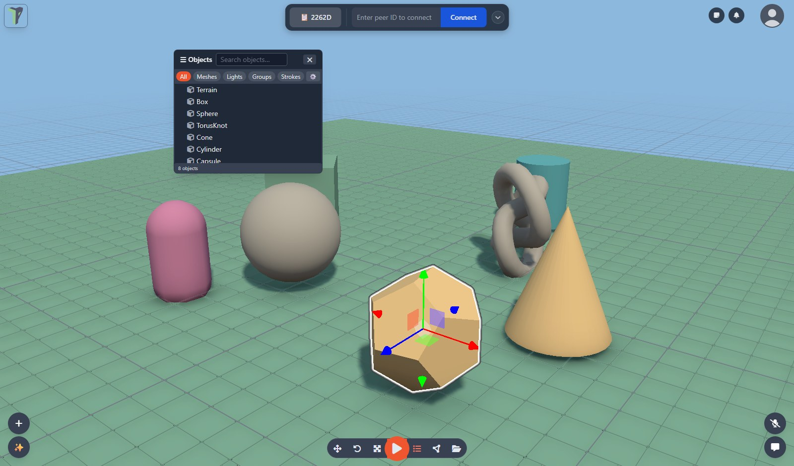
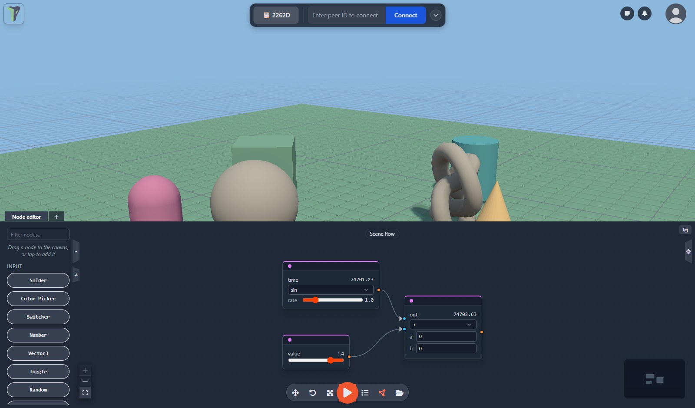

<div align="center">


# theprototype.app

**Build 3D prototypes in your browser — alone or together.**

Peer-to-peer, no account, no server holding your scene. Free and open source.

[](LICENSE)
[](https://svelte.dev)
[](https://threejs.org)
[](https://immersiveweb.dev/)
[](https://docs.theprototype.app)

### [▶ Open theprototype.app](https://theprototype.app) &nbsp;·&nbsp; [📖 Docs](https://docs.theprototype.app) &nbsp;·&nbsp; [🎬 Video](https://www.youtube.com/watch?v=yR21_x4jV7g&list=PLBSyotD7wAZvjCW3ZSKQbNpb-9_f7Q3YM)



</div>

---

## What is it? 🧊

A collaborative 3D editor that runs entirely in the browser. Drop in primitives or your
own models, wire up behaviour in a node graph, turn on physics, and walk through the
result in VR — then send someone your peer ID and they are editing the same scene with
you, in real time.

There is no backend. Sessions run over a **peerjs mesh**: a signalling server introduces
peers, then everything — objects, node graphs, voice, cursors, files — travels directly
between browsers. Nothing about your scene touches our servers, and you can point the app
at your own signalling server or self-host the whole thing.

## Features ✨

**Build together**
- Peer-to-peer sessions with explicit approval for every join — share an ID, approve, done
- Everything replicates: objects, materials, node graphs, annotations, physics, music
- Spatial voice chat, text chat, live cursors, ping markers, per-object locks
- Late joiners get the full scene automatically

**Model and edit**
- Primitives, groups, snapping, measuring, multi-select, undo/redo for everything
- Import `.glb` `.gltf` `.obj` `.stl` `.fbx` — animated rigs replicate as original bytes
- Mesh editing: move vertices, extrude / inset / move faces, polygon selection
- Terrain sculpting with raise / lower / smooth / flatten brushes

**Make it move**
- A node editor (flow) driving events, effects, physics, sound and scripts
- Every object can carry **its own graph**, embeddable in the scene graph as a node
- Rapier physics: dynamic bodies, joints with motors, drag and throw, a simulation HUD
- Particles, deterministic scripted animation, shared background music

**VR 🥽**
- Full WebXR editing with hands *or* controllers — not a viewer mode
- Teleport and fly locomotion, two-handed world grab, snap turning
- Radial menus, grabbable follower panels, a laser keyboard, in-headset mesh editing

**AI, if you want it 🤖**
- A scene assistant that actually builds — create, move, style and wire objects from a
  prompt, undone in one step
- Text-to-3D through ComfyUI/TRELLIS or Meshy, imported straight into the scene
- Bring your own endpoint and key (**Settings ▸ AI**). Nothing leaves the browser until
  you configure one

**Assets and files 📦**
- Explorer: a local asset library with folders, thumbnails, 3D previews, drag-out placing
- Asset packs, installable from a `.zip` or a URL
- `.tpscene` — one file holding objects, graphs, annotations, joints and their assets
- Local autosave with crash recovery



## Quick start 🚀

**Just use it:** open [theprototype.app](https://theprototype.app). Nothing to install, no
sign-up. To collaborate, send someone the peer ID in the top bar and approve their request.

**Run it yourself:** (needs **node 24 or newer**)

```bash
git clone https://github.com/theprototype-app/core.git
cd core
npm install
npm run dev       # https://localhost:5173
```

WebXR and `getUserMedia` need HTTPS, so the dev server serves over TLS using
`certs/localhost.crt` and `certs/localhost.key`. Those are gitignored — generate a
self-signed pair once, from the config already in the repo:

```bash
openssl req -x509 -nodes -days 825 -newkey rsa:2048 \
  -keyout certs/localhost.key -out certs/localhost.crt -config certs/req.cnf
```

Without them Vite falls back to plain http, which disables VR and voice chat.

By default the app uses a public signalling server; point it at your own under
**Settings ▸ Connection**, or set `VITE_PEER_HOST` / `VITE_PEER_PORT` / `VITE_PEER_PATH`
in `.env` (see `.env.example`).

```bash
npm run build     # static site into build/ (adapter-static)
npm run check     # svelte-check
npm run e2e       # Playwright suites (npm run e2e -- <name> for one)
```

## Extend it 🧩

Modules are self-contained bundles of play content — nodes, primitives, click handlers,
effects, VR menu entries — installed from a `.zip` or a URL. The core ships a dungeon
generator, a piano, pong, a drivable car, avatars and a set of clickable interactables.

- [`MODULES.md`](MODULES.md) — authoring guide and the SDK surface
- [`NODES.md`](NODES.md) — the node catalogue
- [`PACKS.md`](PACKS.md) — asset pack format
- [`OPEN-CORE.md`](OPEN-CORE.md) — the seams the optional cloud tier plugs into
- [theprototype-app/modules](https://github.com/theprototype-app/modules) — community modules

## Project layout 🗺️

| Path | What lives there |
|---|---|
| `src/components/` | Svelte UI — menus, editors, VR panels, scene overlays |
| `src/lib/` | the engine: replication, physics, flow runtime, VR, assets, files |
| `src/stores/` | app / scene / flow state |
| `src/modules/` | core modules |
| `tests/e2e/` | Playwright suites, including two-peer sessions |

## Contributing 🤝

Issues and pull requests are welcome. Before opening a PR: `npm run build` should pass and
`npm run check` should not add new errors. If you touch a feature, update or add its
Playwright suite in `tests/e2e/`.

## Support the project ❤️

theprototype.app is free and MIT-licensed. If it is useful to you, sponsoring it (the
**Sponsor** button at the top of this repo) helps pay for the signalling and relay servers
that keep public sessions connecting. Starring the repo and telling someone about it helps
just as much.

## License 📜

[MIT](LICENSE).

Bundled sample assets keep their own licences — see each pack's attribution entry in the
Explorer, and [`PACKS.md`](PACKS.md).
